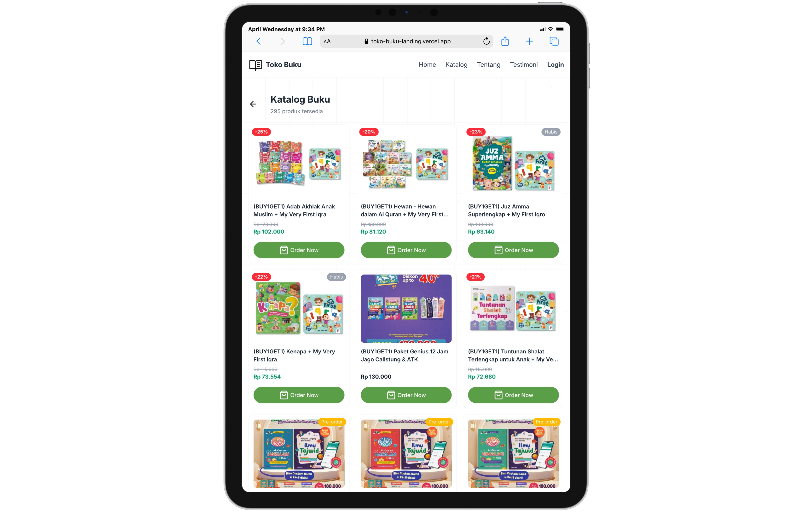
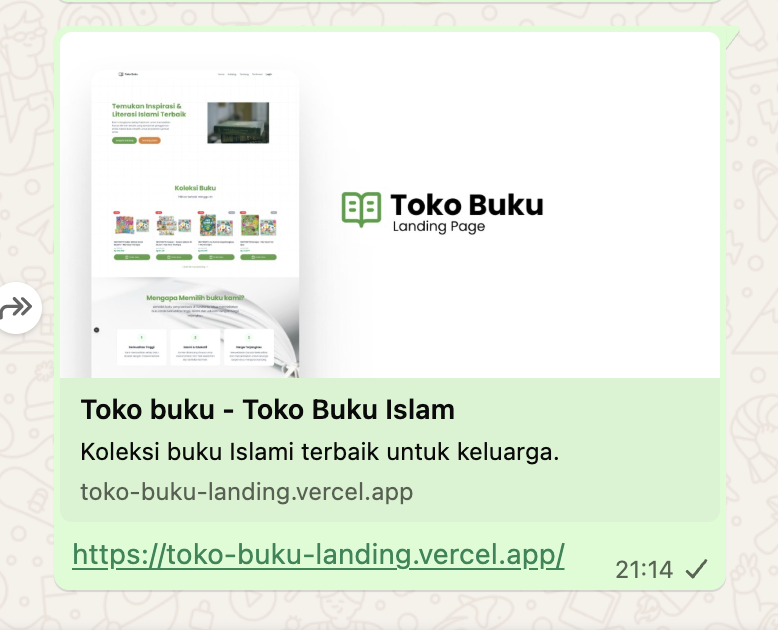

# Toko Buku Landing Page

Web landing page dan katalog e-commerce untuk Toko Buku. Dibangun menggunakan Next.js dan Tailwind CSS. 

- https://toko-buku-landing.vercel.app
- https://toko-buku-landing.vercel.app/products

## Tech Stack

- Next.js 16
- React 19
- Tailwind CSS v4
- TypeScript
- Phosphor Icons & Lucide React

## Cara install localnya

1. Clone repo:

   ```bash
   git clone https://github.com/evandaru/tokobuku-landing.git
   cd tokobuku-landing
   ```

2. Install dependencies:

   ```bash
   pnpm install
   ```

3. Copy dari buat `.env` dengan cara ini
   ```
   cp .env.example .env
   ```
   trus di isi `.env` token dan url yang sudah di sediakan

    ```env
    URL=
    TOKEN=
    ```

4. Jalankan server:

   ```bash
   pnpm run dev
   ```

5. buka http://localhost:3000/ buat liat hasilnya atau dengan mengakses website https://toko-buku-landing.vercel.app

## beberapa screenshot project

Halaman Landing Page


Halaman Landing Page - Mobile


Halaman katalog - Tablet


WhatsApp
